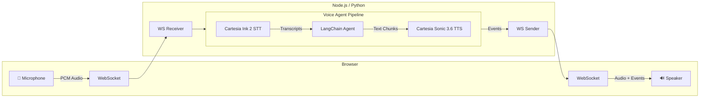
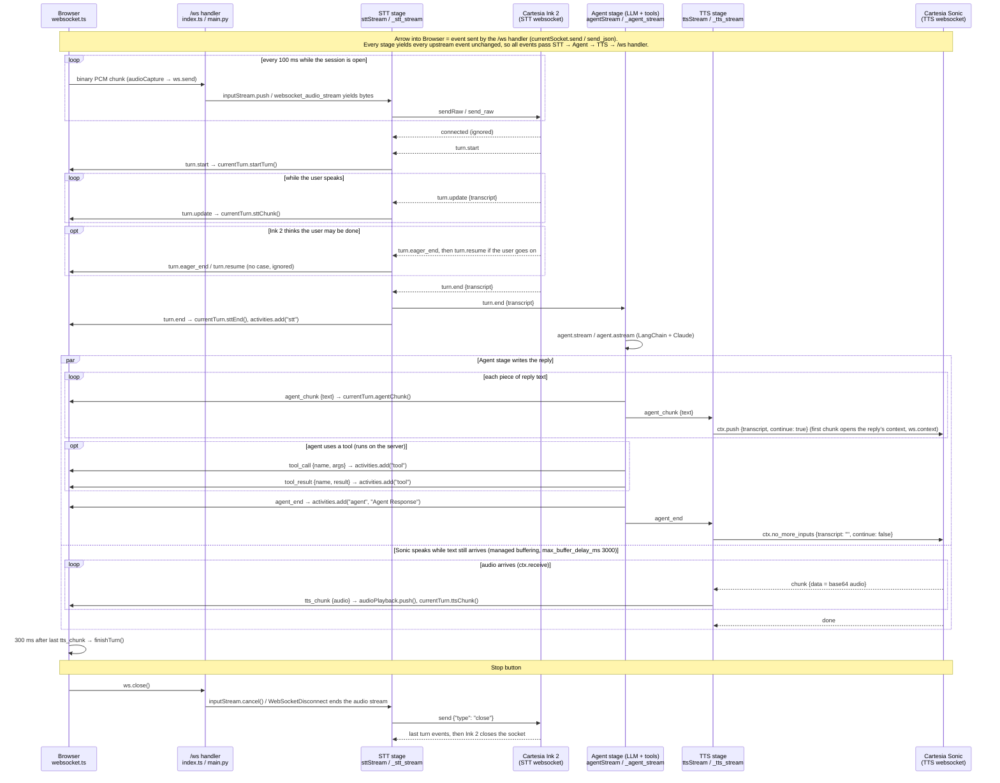

# Voice Sandwich Demo 🥪

A real-time, voice-to-voice AI pipeline demo featuring a sandwich shop order assistant. Built with LangChain/LangGraph agents, Cartesia Ink 2 for speech-to-text, and Cartesia Sonic 3.6 for text-to-speech.

## Architecture

The pipeline processes audio through three transform stages using async generators with a producer-consumer pattern:



### Pipeline Stages

Each stage is an async generator that transforms a stream of events:

1. **STT Stage** (`sttStream`): Streams audio to Cartesia Ink 2, yields its turn events (`turn.start`, `turn.update`, `turn.end`, ...)
2. **Agent Stage** (`agentStream`): Passes upstream events through, invokes LangChain agent on each `turn.end`, yields agent responses (`agent_chunk`, `tool_call`, `tool_result`, `agent_end`)
3. **TTS Stage** (`ttsStream`): Passes upstream events through, streams each `agent_chunk` to Cartesia Sonic as it arrives (one context per reply, with continuations), yields audio events (`tts_chunk`). Voice starts before the agent finishes its reply.

### Event sequence (one turn)

Each label uses the names in the code: TypeScript first, then Python (`sttStream / _stt_stream`). After `→` is the function the browser calls in `components/web/src/lib/websocket.ts`.

Agent stage = the LLM with its tools and chat memory. It is one stage in the pipeline, not the whole voice app.



## Prerequisites

- **Node.js** (v18+) or **Python** (3.11+)
- **pnpm** or **uv** (Python package manager)

### API Keys

| Service | Environment Variable | Purpose |
|---------|---------------------|---------|
| Cartesia | `CARTESIA_API_KEY` | Speech-to-Text (Ink 2) and Text-to-Speech (Sonic) |
| Anthropic | `ANTHROPIC_API_KEY` | LangChain Agent (Claude) |

## Quick Start

### Using Make (Recommended)

```bash
# Install all dependencies
make bootstrap

# Run TypeScript implementation (with hot reload)
make dev-ts

# Or run Python implementation (with hot reload)
make dev-py
```

The app will be available at `http://localhost:8000`

### Manual Setup

#### TypeScript

```bash
cd components/typescript
pnpm install
cd ../web
pnpm install && pnpm build
cd ../typescript
pnpm run server
```

#### Python

```bash
cd components/python
uv sync --dev
cd ../web
pnpm install && pnpm build
cd ../python
uv run src/main.py
```

## Project Structure

```
components/
├── web/                 # Svelte frontend (shared by both backends)
│   └── src/
├── typescript/          # Node.js backend
│   └── src/
│       ├── index.ts     # Main server & pipeline
│       ├── cartesia/    # TTS system prompt (STT and TTS use the Cartesia SDK in index.ts)
│       └── elevenlabs/  # Alternate TTS client
└── python/              # Python backend
    └── src/
        ├── main.py             # Main server & pipeline
        ├── cartesia_prompts.py # TTS system prompt
        ├── elevenlabs_tts.py   # Alternate TTS client
        └── events.py           # Event type definitions
```

## Event Types

The pipeline communicates via a unified event stream:

| Event | Made by | Used by | Description |
|-------|---------|---------|-------------|
| `turn.*` | STT stage | Agent stage (`turn.end`), browser | Cartesia Ink 2 turn events: `turn.start`, `turn.update` (transcript so far), `turn.eager_end`, `turn.resume`, `turn.end` (final transcript, triggers the agent) |
| `agent_chunk` | Agent stage | TTS stage, browser | Text chunk from agent response |
| `tool_call` | Agent stage | browser | Tool invocation |
| `tool_result` | Agent stage | browser | Tool execution result |
| `agent_end` | Agent stage | TTS stage, browser | End of the agent's reply |
| `tts_chunk` | TTS stage | browser | Audio chunk for playback |
